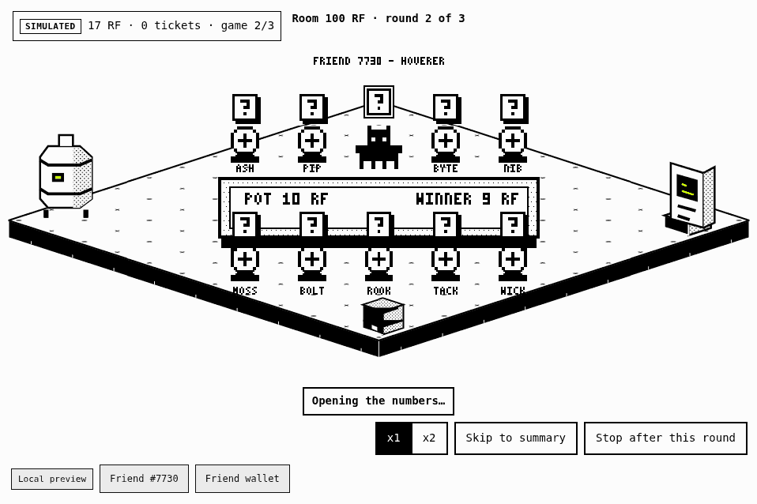
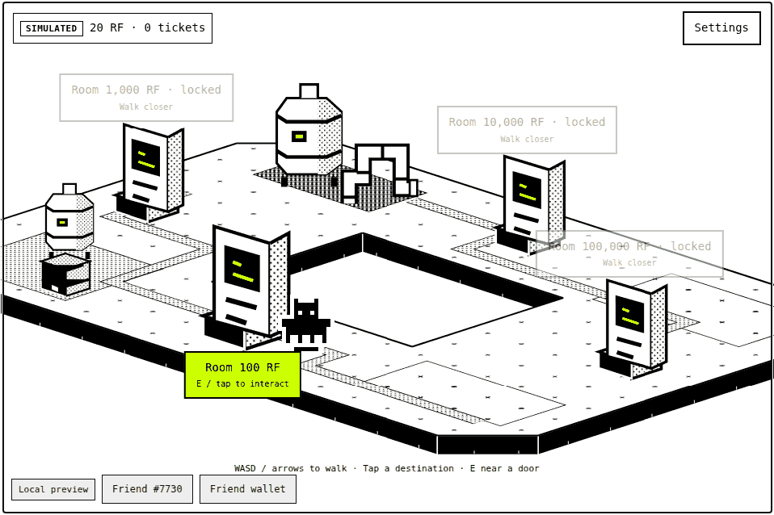
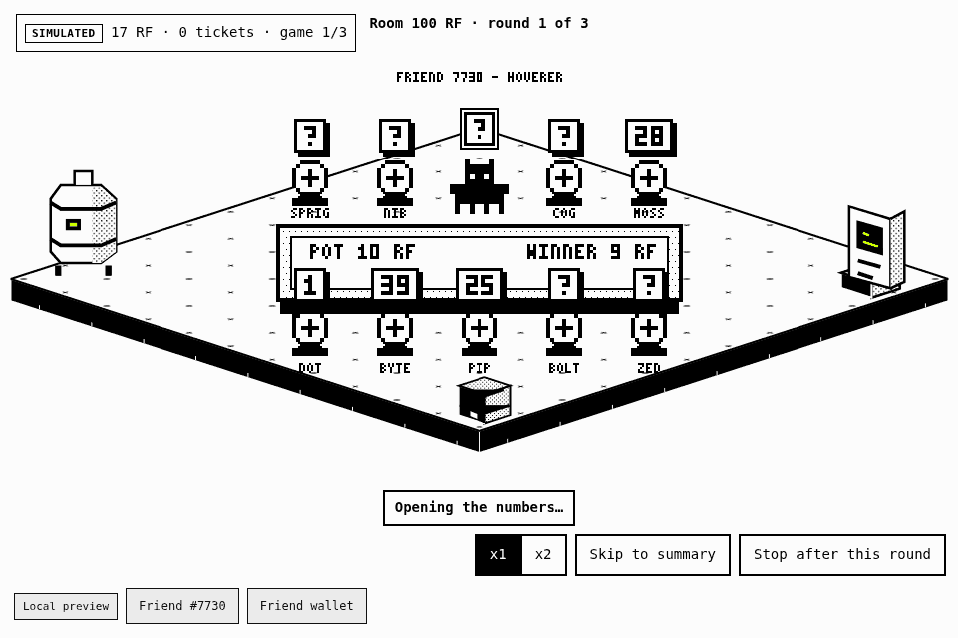
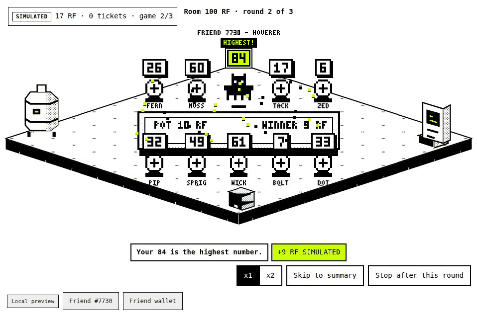
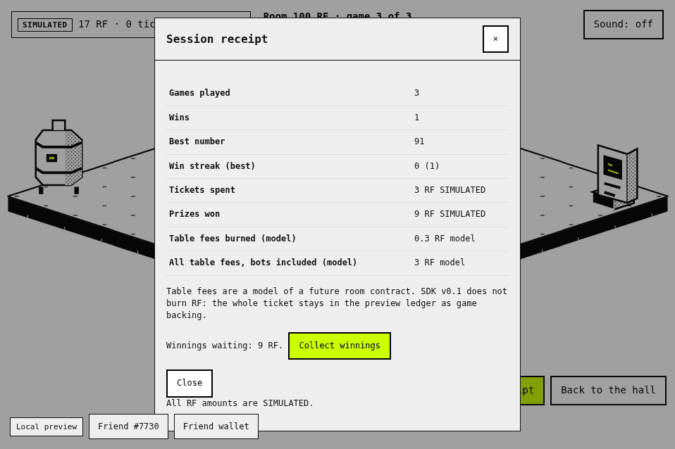

# Friend Rooms

SDK version **v0.1**. Your Rare Friend walks through a black-and-white isometric hall to a numbered
room door. Behind the working door, ten seats share one table: your Friend and nine simulated bots. Every seat draws a
unique number from 1 to 100 and the highest number wins.

**Everything is simulated.** Prices, balances, prizes and the burn use the SDK preview ledger or a labelled model.
Nothing is sent on-chain. An owned Generations NFT is still required; the SDK runtime checks it.

## Screenshots



*One round, played at x1 speed: bots open from the lowest number up, the Friend's number opens last, then the win.*

| Hall with the working door and three locked doors | Table during the reveal (closed plates show ?) |
| --- | --- |
|  |  |
| **A win: HIGHEST! and +9 RF SIMULATED** | **Session receipt** |
|  |  |

*These images come from the game running in the SDK's public runner with the SDK's mocked, read-only test wallet and its
sample Friend #7730. The preview rolls are scripted (a loss, a win, a loss) so that a win can be shown; all amounts are
simulated. Regenerate them with `node games/friend-rooms/capture-media.mjs` (needs Python 3 with Pillow).*

## How to play

- Move with WASD, the arrow keys, or tap/click a destination. Walk to a door and press E (or tap its label).
- The **Room 100 RF** door opens the room menu. Choose how many games to play, then confirm the SDK prompts:
  one to buy the tickets and one to use them. Your Friend then plays every game on its own.
- Use **Stop after this round** to pause a run. Unfinished rounds stay with your Friend; **Resume** settles those
  same rounds and never buys or uses another ticket.
- Winnings wait in your inventory until you press **Collect winnings** (one more SDK prompt).
- Settings has mute and reduce motion. Reduce motion is also read from your system setting.
- The three other doors (Room 1,000 / 10,000 / 100,000 RF) are locked: they need future SDK support.

## Rules and economy

| Rule | Exact value |
| --- | --- |
| Room shown on the working door | Room 100 RF (design size) |
| Preview ticket | 1 RF (`1000000000000000000` base units). The SDK preview wallet is fixed at 20 RF, so the room runs at 1/100 of its design size |
| Highest number | 10% (1,000 basis points), prize 9 RF |
| Lower number | 90% (9,000 basis points), prize 0 RF |
| Expected reward | 0.9 RF per ticket (90% return) |
| Table | 10 seats: your Friend plus 9 simulated bots, always full |
| Pot | 10 tickets (10 RF). The winner takes 9 RF (90%); 10% (1 RF) is burned in the model |
| Backing | Each ticket reserves 9 RF of prize backing, so one run is limited to 11 games in the SDK preview |
| Redemption | Fixed value, no expiry, paid to the selected Friend's wallet in a future approved integration |

**The SDK result decides your outcome.** After each round the SDK settles the ticket. The table is then dealt to match it:
a win gives your Friend the highest number, a loss gives it one of the lower numbers, chosen evenly. Because one table
seat in ten wins, this matches the 10% chance in `game.json`. The numbers and bots are presentation only.

**The burn is a model.** SDK v0.1 does not burn RF: the 10% stays as game backing. The receipt labels the burn as a
model of a future room contract. Bot tickets are simulated too.

## Measured behaviour

The check plays tickets through the SDK preview client (`createGamePreview`, batches of 99 like the runtime bridge),
settles every play, redeems every win and confirms that the SDK ledger adds up. Each settled play also deals a table
and checks that the Friend holds the highest number exactly when the SDK result is a win.

| Run | Plays | Wins | Win rate (95% interval) | RF spent | RF redeemed | Measured return |
| --- | ---: | ---: | --- | ---: | ---: | ---: |
| Seed 20260920 (reproducible) | 10,000 | 989 | **9.89%** (9.32% to 10.49%) | 10,000 | 8,901 | **89.01%** |
| Expected from `game.json` | | | 10.00% | | | 90.00% |

*Measured 9.89% win rate over 10,000 preview plays; the average reward was 0.8901 RF per 1 RF ticket.* The seed was
fixed before the run and not chosen afterwards. Two one-off runs with the SDK's own browser randomness agree: 9.85% and
88.65% return over 10,000 plays, and 9.93% and 89.34% over 100,000 plays. With 10,000 plays the win rate has a standard
error of about 0.3 points and the return about 2.7 points, so differences of this size are expected.

In the model, the tables of those 10,000 games burned 10,000 RF in total (10% of each 10 RF pot), and your Friend's share
of that was 1,000 RF. This burn is a model; the SDK preview does not burn RF.

Reproduce it from the SDK root: `node games/friend-rooms/simulate.mjs 10000 20260920` (leave out the seed to use the SDK's
randomness). `table.test.mjs` pins the seeded numbers above, so this section cannot drift from the code.

## Future SDK support

Friend Rooms is a preview. A real version needs SDK capabilities that do not exist in v0.1. Nothing in this game
pretends otherwise: every amount is labelled SIMULATED and the locked doors say so.

| Needed capability | Why | In this preview |
| --- | --- | --- |
| Shared rooms with real players | Seats filled by other owners' Friends | Nine simulated bots |
| Several ticket tiers (Room 100 / 1,000 / 10,000 / 100,000 RF) | Different stakes | One ticket type; the locked doors show the plan |
| A room contract with one allowance | Approve once, then join rooms without a prompt each time | Preview ledger; the SDK asks to confirm buy and use |
| A keeper bot and unattended settlement | Start a round when the room is full, without a player click | The player's own client settles |
| One Dice randomness per round | A single random value seeds the shuffle for every player | Browser randomness; numbers are dealt to match the SDK result |
| Gas and randomness paid from the round fee | Players pay only the ticket | Not modelled |
| Burning the remainder of the fee | Costs are paid first, the rest is burned | A labelled model, not executed |
| Reading shared room state from game code | Occupants and how full a room is | Not available |
| Larger rooms | 100 seats; winners = ceil(participants / 10): 1-10 players give 1 winner, 11-20 give 2, and so on up to 91-100 giving 10; 10% of the pot is burned and 90% is shared equally between the winners | Ten seats and one winner |
| A preview wallet larger than 20 RF | Play a real 100 RF ticket | The room runs at 1/100 scale |
| Friend traits as a style source | Scenery, Floor and Generation could style the hall | One hall (Circuit Courtyard) for every Friend |

### How real Friends join rooms

In this preview every neighbour is a bot. In a future version:

1. **The room lives in a contract.** The contract holds the seat queue and how full each room is.
2. **Players join with one allowance.** A player approves RF once; joining a room then takes one transaction.
3. **A keeper starts the round.** Anyone can act as keeper. When the room is full, the keeper asks Dice for one random
   value for the whole round.
4. **The shuffle comes from that one value.** Every seat's number is derived from it, so every client can recompute it.
5. **Each player's client reads the result from the chain** and draws the real participants with their canonical Friend
   sprites, at the same scale as the Friend at the table today.

A contract is better than a separate server because fairness can be checked on-chain. No operator can pick the winners, hold
the pot or replay a round, and anyone can recompute the shuffle from the published randomness. If a keeper goes offline,
another one can start the round. What the SDK lacks for this: reading shared room state from game code, multiplayer room
contracts, and unattended settlement.

### Minimum ticket size (estimate)

Prices for ETH and RF move a lot, so the rule is a formula, not a fixed number. A room is viable while its round costs are
no more than its round fee:

```text
round costs (USD) = (gas + RNG fee, in ETH) x ETH price
round fee   (USD) = 10% x seats x ticket (RF) x RF price
viable when round costs <= round fee, so
minimum ticket (RF) = round costs / (10% x seats x RF price)
```

Fee model: the 10% fee first pays the actual costs of the round; whatever is left is burned. If costs exceed the fee, the
round should not start.

*Estimate as of 2026-09-20. Inputs: ETH about $2,450 and 100,000 RF about 0.128 ETH (a community tracker, not independently
verified), so 1 RF is about $0.0031. The SDK caps a Dice request at 0.000025 ETH (about $0.06); gas is an assumption, and
round costs are taken as about $0.10 in total. Rare Friends plans to subsidize randomness costs, which would lower this.*

With 10 seats:

| Ticket | Pot | Round fee (10%) | Fee / costs | Burned after costs |
| ---: | ---: | ---: | ---: | ---: |
| 1 RF | $0.03 | $0.003 | 0.03x, not viable | none |
| 10 RF | $0.31 | $0.031 | 0.31x, not viable | none |
| 100 RF | $3.14 | $0.314 | 3.1x | about 68% of the fee |
| 1,000 RF | $31.36 | $3.14 | 31x | about 97% |
| 10,000 RF | $313.60 | $31.36 | 314x | about 100% |
| 100,000 RF | $3,136 | $313.60 | 3,136x | about 100% |

At 10 seats the minimum is about 32 RF, so 100 RF is the smallest listed room that works. A 100-seat room needs about a tenth
of that (about 3 RF). That is why the working door is Room 100 RF.

Protections a future contract should have: the RF/ETH rate comes from a time-weighted average price (TWAP) of a pool, not the
spot price; a round does not start when its costs are above a threshold; and the minimum denomination is a configurable
parameter, not a constant.

### A Friend's own world as style

Every Friend has on-chain Scenery and Floor traits (for example Industrial or Rooftop, Plain or Hatch), and its world reflects
its generation. SDK v0.1 does not give game code access to them, and its six world presets do not cover every Scenery value.
A future SDK could expose these traits and a matching set of worlds. The hall layout would stay the same for everybody, and
only its style (floor, decor, objects) would follow the selected Friend.

## Files

`index.tsx` (hall, door menu, SDK flow), `room.tsx` (table scene), `table.ts` (numbers, economy, career), `table.test.mjs`
(unit tests), `simulate.mjs` (10,000-play measurement), `check-browser.mjs` (browser check), `capture-media.mjs` and `assemble-media.py`
(the images in `media/`), `game.json` (ticket price and outcomes).

## Checks

Run on 2026-09-20 with SDK v0.1 and Node.js 22, from the SDK root:

| Command | Result |
| --- | --- |
| `npm test` | 111 tests: 109 passed, 0 failed, 2 skipped (they need Foundry, which is not installed here) |
| `npm run typecheck` | passed |
| `npm run check:games` | passed, including `games/friend-rooms` |
| `npm run check:browser` | all SDK browser checks passed. They cover the SDK runtime and examples, not this game |
| `node --test games/friend-rooms/table.test.mjs` | 9 passed: table rules, economy and the 10,000-play measurement |
| `node games/friend-rooms/check-browser.mjs` | passed at 1100 px and 360 px with the SDK's mocked, read-only wallet fixture: canonical Friend movement, locked door, buy and use through the SDK, table numbers, receipt, Stop and Resume, Collect winnings, settings, container bounds and no button under the SDK toolbar |

The browser check needs `npx playwright install chromium` once.

## Known limits

- The SDK preview wallet is fixed at 20 RF, so tickets cost 1 RF (Room 100 RF at 1/100 scale) and one run is limited to 11 games by the prize backing.
- Bots, the shared table and the burn are simulated; SDK v0.1 has no shared rooms and does not burn RF.
- Progress resets when the preview session ends.
- On a 360 px wide screen the SDK container is only 360 x 240, so the table is small.
- Automated checks use a mocked wallet and a sample Friend. The builder played more than 40 games by hand with a real wallet and two Friends: Generation 2 (Cellular) and Generation 4 (Skeleton).
